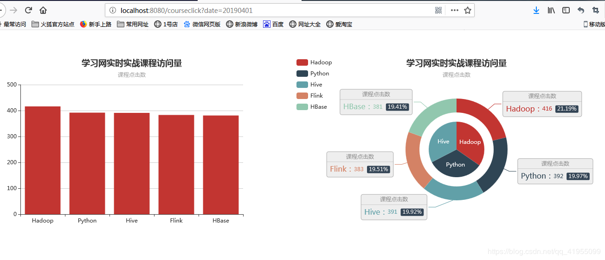
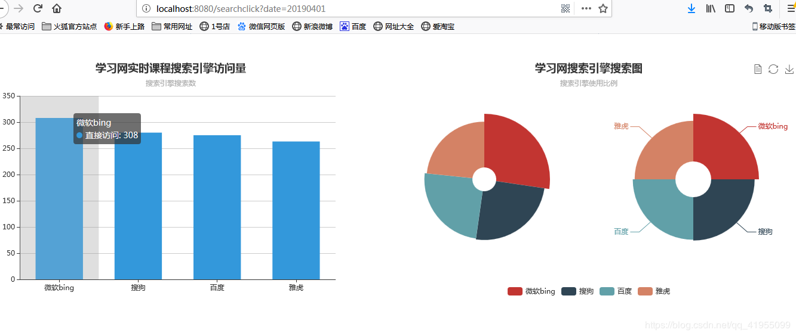

# 1. 概述
这个工程是大数据实时流处理日志系统的统计数据展示部分，采用 SpringBoot + SSM + ECharts 的架构。

统计数据储存在 HBase 中，元数据信息保存在关系型数据库中，为了测试方便，这里使用的是 Spring 的嵌入数据库 H2。

前端页面展示采用 EChart。

# 2. 版本
- SpringBoot-2.2.1
- Spring MVC-4.3.3.RELEASE
- Spring-4.3.3.RELEASE
- MyBatis-3.2.1
- h2-1.4.192
- Echarts 4.3.0

# 3.访问接口
提供两个访问接口：

1. 课程统计数据

获取指定日期的课程点击量统计数据
```sbtshell
courseClick?date=20191208
```


2. 搜索引擎统计数据

获取指定日期的搜索引擎访问量统计数据
```sbtshell
searchClick?date=20191208
```



&nbsp;
> 参考：https://blog.csdn.net/qq_41955099/article/details/88959996